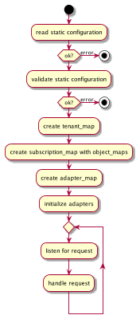
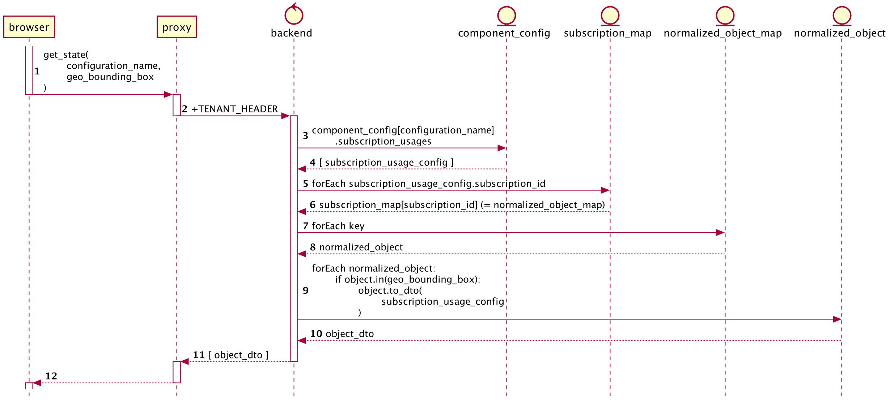

# Backend Behaviour

!!! note
    Diagrams can be clicked and open in a new tab

## Introduction

The backend is a stand-alone __docker-compose__ application.
It has one container. A configuration directory is mapped
into the container under `/svc/build/config`.

The backend is a __monolith__. __Adapters__ for different
data sources are built into it as libraries. __No plugin
concept__ is implemented, all code is built into the image
and is directly called as functions

## Startup

1. Start up and read JSON configuration file(s)
1. Validate static config
1. Build a __tenant map__ from component configs
1. For each subscription configured in any configuration, create a normalized object map and store it in the subscription map
1. Create adapters from __adapter config__
1. Let adapters __maintain__ their configured __subscriptions__

{: target="_blank"}

Static configuration is read from a directory mapped into the container

{: target="_blank"}

## Client REST API

### GET api/v1/get_configurations

A list of tenants the client belongs to (1+) is implicitly
provided in HTTP headers.

{: target="_blank"}

Steps performed:

1. For all of the client's tenants, a list of
   `configuration_name` exists in tenant map. Return the union
   of these lists.

### POST api/v1/init_component

A list of tenants the client belongs to (1+) is implicitly
provided in HTTP headers.

Parameters: 

* `configuration_name`

{: target="_blank"}

The web component is configured with a `configuration_name`,
either statically or dynamically with one of the tenants
returned from `get_configurations()`.
  
Steps performed:

1. Verify that `component_name` is in tenant map for one of 
   client's tenants, fail if not
1. Start applicable subscriptions
1. Return map attributes from named configuration

### POST api/v1/get_state

A list of tenants the client belongs to (1+) is implicitly
provided in HTTP headers. 

Parameters:

* `configuration_name`
* `geo_bounding_box` is a pair of geo-coordinates spanning a 
  rectangle. It designates the current view on the map. Only 
  objects within that recatangle are delivered.
  
{: target="_blank"}

Steps performed:

1. Verify that component_name is in tenant map for one of 
   client's tenants, fail if not
1. Create empty result list
1. Get list of `subscription_usage_config` from configuration map
1. For each `subscription_usage_config`, lookup normalized 
   object map in subscription map
1. For all normalized objects in map: 
   if `object.in(geo_bounding_box)`, convert object to 
   __ObjectDTO__, and add that to result

Convert object to ObjectDTO by omitting attributes.

The result contains an entry for each observed object in its
current state.
